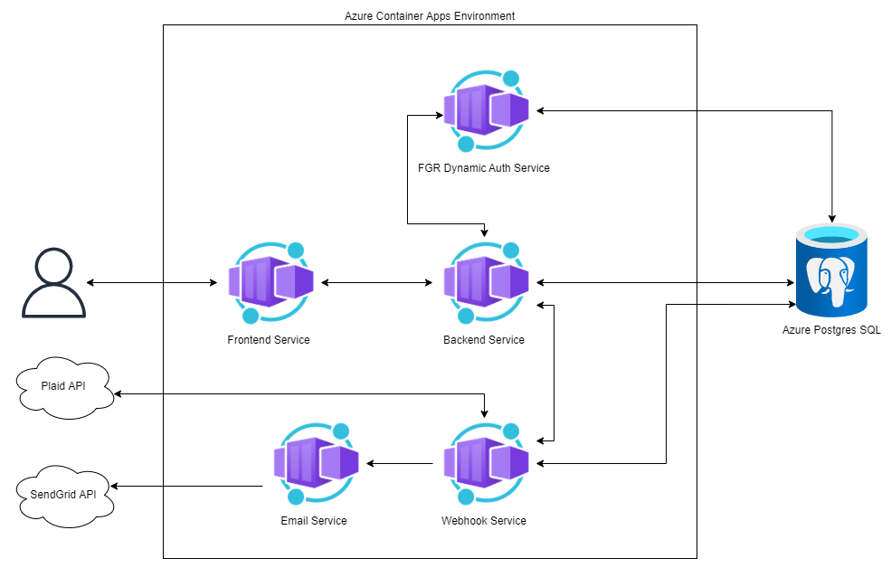

## What is this Azure Container Apps Demo?

Microservice Architected application deployed with Infrastructure as Code using Bicep to Microsoft Azure’s new Azure Container Apps offering.
This Container Apps deployment demonstrates my proficiency with containerization, Azure’s Infrastructure as Code Domain Specific Language Bicep, and use of Azure’s serverless container offering Azure Container Apps. The application use case follows my previous Kubernetes deployment of a personal budget app that connects to bank accounts and allows users to track transactions, and manage budgets.

Learn more about this demo [here](https://frankieriviera.com/portfolio/azure-container-apps-deployment)

Overview of Microservice Architecture

 

The diagram above displays the architecture setup of my FGR budget app deployment using Azure Container Apps. Resources can be created using Bicep in order to leverage The power of infrastructure as code for reliable, and quick deployments. The frontend application allows for external ingress while the rest of the container apps only allow ingress within the container app environment. Postgres DB tables are populated via entering into the webhook container to run database migrations using Object Relational Mapper Sequelize. 

  


----
Deployment
---

1. Populate the values in deploy.ps1 and also Main.bicep

2. Then run deploy.ps1 to deploy infrastructure.

After the run, you should get an output with infomation needed to deploy the frontend container app with its current set up.

The Output may look something like
```
[
  "https://back-fgr-sxarqprgpaane.internal.salmonbay-09b69841.eastus.azurecontainerapps.io",
  "cae-fgr-sxarqprgpaane",
  "your-resource-group-name"
]
```

3. Populate the values in deploy-frontend.ps1 from the outputs you received.

4. Then login to docker
`docker login`

4. Run deploy-frontend.ps1

After this script completes, The Azure Container App should be up and running for you to access at the output URL shared at the end this most recent script.


Learn more about [Azure container Apps](https://azure.microsoft.com/en-us/services/container-apps/)

To see some of my other portfolio projects check out my website at https://frankieriviera.com 